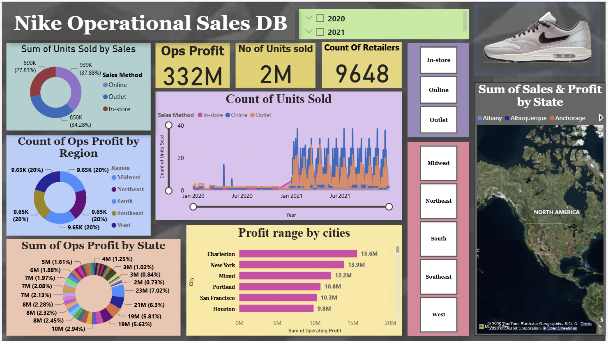
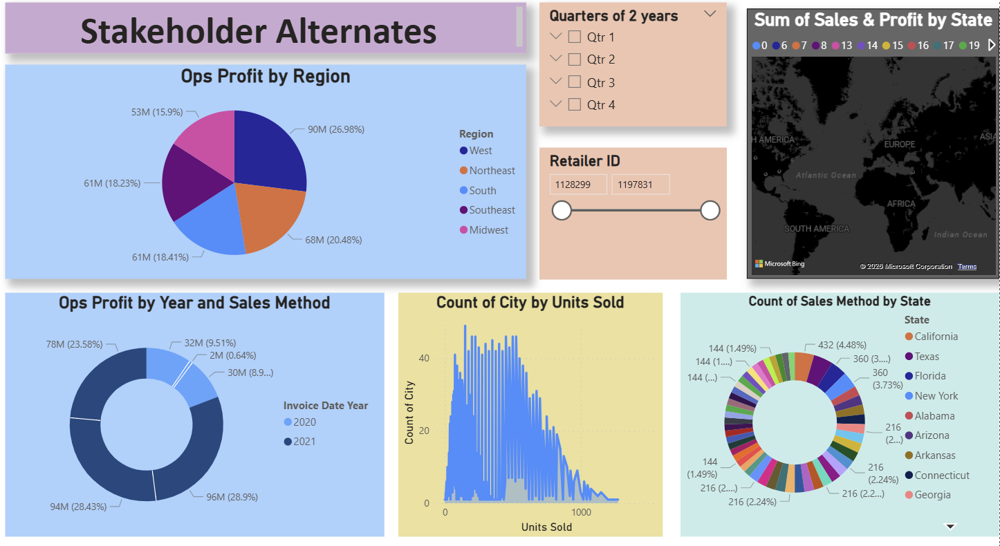

# Nike Sales Dashboard

**Project Overview**
This project analyzes Nike sales performance using an interactive Power BI dashboard. The dashboard provides insights into sales trends, profitability, regional performance, and product analysis.

**Objective**
To analyze Nike sales data and identify key business insights for better decision-making.

**Tools Used**
- Power BI
- Excel

**Features**
- Interactive dashboard
- KPI analysis
- Regional sales trends
- Product performance analysis
- Sales visualization

**Key Insights**
- Certain regions generated higher sales revenue
- Product categories showed varying profitability
- Sales trends indicated seasonal fluctuations

**Recommendations**
- Improve focus on high-performing regions
- Optimize low-performing product categories
- Enhance inventory planning during peak demand periods
  
**Project Files**
- Power BI Dashboard (.pbix)
- PPT Presentation
- Dataset (.xlsx)

  
## Dashboard Preview

